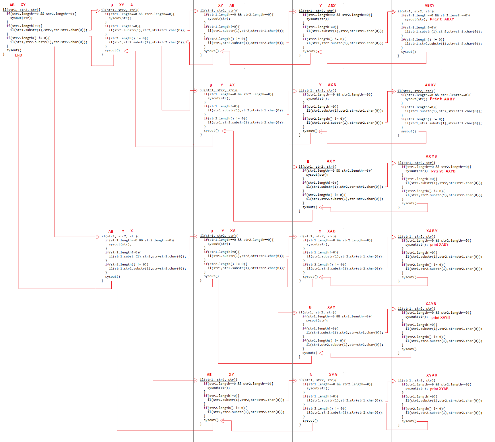

# Recursion
  
**What is Recursion?**  

The process in which a function calls itself directly or indirectly is called recursion and the corresponding function is called as recursive function.  
The idea is to represent a problem in terms of one or more smaller problems, and add one or more base conditions that stop recursion.  
  
**Types of Recursion**    
  
Direct : A function fun is called direct recursive if it calls the same function say f .  
Indirect : A function fun is called indirect recursive if it calls another function say f1 and f1 calls f directly or indirectly.  
  
# Towers of Hanoi
  
Tower of Hanoi is a mathematical puzzle where we have three rods and n disks. The objective of the puzzle is to move the entire stack to another rod, obeying the following simple rules:  
1) Only one disk can be moved at a time.  
2) Each move consists of taking the upper disk from one of the stacks and placing it on top of another stack i.e. a disk can only be moved if it is the uppermost disk on a stack.  
3) No disk may be placed on top of a smaller disk.  
  
  


  
# Interleaving of 2 strings :
  
**Example**
```
Input: str1 = "AB",  str2 = "XY"
Output:
    ABXY
    AXBY
    AXYB
    XABY
    XAYB
    XYAB
  ```
    
An interleaved string of given two strings preserves the order of characters in individual strings. For example, in all the interleavings of above example, ‘A’ comes before ‘B’ and ‘X’ comes before ‘Y’. 

**Count of Interleaving Strings**
  
 Let count(m, n) be the count of all interleaved strings in such strings. The value of count(m, n) can be written as following.  
 ```
     count(m, n) = count(m-1, n) + count(m, n-1)
     count(1, 0) = 1 and count(0, 1) = 1
       where,
        m is the length of string 1.
        n is the length of string 2.
```  
**Full stack trace to print all interleaving of Strings.**  
  



