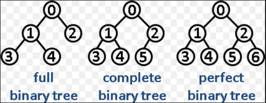

# Trees
  
 Unlike Arrays, Linked Lists, Stack and queues, which are linear data structures, trees are hierarchical data structures.  
   
 **Basic Terminology**
   
The topmost node is called root of the tree. The elements that are directly under an element are called its children. The element directly above something is called its parent.  

**Applications of Trees**
  
1. Manipulate hierarchical data.  
2. Make information easy to search.  
3. Manipulate sorted lists of data.  
4. As a workflow for compositing digital images for visual effects.  
5. Router algorithms  
  
# Binary Tree
  
A tree whose elements have at most 2 children is called a binary tree. Since each element in a binary tree can have only 2 children, we typically name them the left and right child.   
  
**Properties**
  
1) The maximum number of nodes at level 'l' of a binary tree is 2<sup>(l-1)</sup> , considering the level of root as 1.  
  
2) Maximum number of nodes in a binary tree of height ‘h’ is 2<sup>h</sup> – 1.  
  
3) In a Binary Tree with N nodes, minimum possible height or minimum number of levels is  ⌈ Log<sub>2</sub>(N+1) ⌉  
  
4) A Binary Tree with L leaves has at least   ⌈ Log<sub>2</sub>L ⌉ + 1   levels.  
  
5) In Binary tree, number of leaf nodes is always one more than nodes with two children. ( Handshaking Lemma)  
  
**Types**
  
1) Full Binary Tree A Binary Tree is full if every node has 0 or 2 children.  
  
2) Complete Binary Tree: A Binary Tree is complete Binary Tree if all levels are completely filled except possibly the last level and the last level has all keys as left as possible  
  
3) Perfect Binary Tree A Binary tree is Perfect Binary Tree in which all internal nodes have two children and all leaves are at same level.  
    
4) Balanced Binary Tree : A binary tree is balanced if height of the tree is O(Log n) where n is number of nodes.   
  

 
  
**Traversals** 
  
1) Inorder : 
  
``` 
Algorithm Inorder(tree)
   1. Traverse the left subtree, i.e., call Inorder(left-subtree)
   2. Visit the root.
   3. Traverse the right subtree, i.e., call Inorder(right-subtree)
```
  
2) Preorder :
  
``` 
Algorithm Preorder(tree)
   1. Visit the root.
   2. Traverse the left subtree, i.e., call Preorder(left-subtree)
   3. Traverse the right subtree, i.e., call Preorder(right-subtree)
```
  
3) Postorder :
  
```
Algorithm Postorder(tree)
   1. Traverse the left subtree, i.e., call Postorder(left-subtree)
   2. Traverse the right subtree, i.e., call Postorder(right-subtree)
   3. Visit the root.
```
  
4) Level Order Traversal :
  
The keys of the tree are traversed level by level, i.e starting at the root level and traversing the consequent levels (left to right) until the leaf level.
  
# Heap Trees
  
A Binary Heap is a Binary Tree with following properties.  
```  
1) It’s a complete tree (All levels are completely filled except possibly the last level and the last level
has all keys as left as possible). 
This property of Binary Heap makes them suitable to be stored in an array.  

2) A Binary Heap is either Min Heap or Max Heap. In a Min Binary Heap, the key at root must be minimum among 
all keys present in Binary Heap. The same property must be recursively true for all nodes in Binary Tree. 
Max Binary Heap is similar to MinHeap.
```  


  
