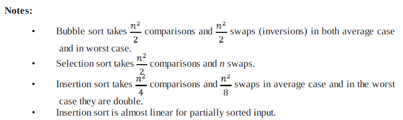

# Stability in Sorting Algos :
  
A sorting algorithm is said to be stable if two objects with equal keys appear in the same order in sorted output as they appear in the input array to be sorted.  
Formally stability may be defined as,  
Let A be an array, and let < be a strict weak ordering on the elements of A.  
A sorting algorithm is stable if-  
i<j and A[i]=A[j] implies p(i)<p(j)  
where p is the sorting permutation ( sorting moves A[i] to p(i) )  
  
# Bubble Sort :
  
Bubble Sort is the simplest sorting algorithm that works by repeatedly swapping the adjacent elements if they are in wrong order. It begins at the beginning of the dataset and continues doing this for each pair of adjacent elements upto the end of the dataset. This process is repeated until no more swaps take place in an iteration.  

```  
Time Complexity :
Worst Case : O(n^2)
Best Case : O(n)
Average Case : O(n^2)
Space complexity : O(1)
```
# Insertion Sort :
  
In this sort, the elements are selected from the array one by one and are inserted in an appropriate position by scanning the part of the array to the left of it. This is similar to arranging a set of cards in your hand, where, you insert a card in an appropriate position by scanning the given set from right to left.
    
```
Time Complexity:
Worst Case : O(n^2)
Best Case : O(n)
Average Case : O(n^2)
Space complexity : O(1) auxiliary
```

# Selection Sort :
  
This sorting technique finds the smallest element in the data set and swaps it with the element in the current position. This process is repeated for the remaining list.
  
```
Time Complexity:
Worst Case : O(n^2)
Best Case : O(n^2)
Average Case : O(n^2)
Space complexity : O(1)
```
  


# Merge Sort : 
  
This technique splits the array onto two halves, the left and right halves are again split into two each, this process of splitting is repeated until no more splitting is possible. It then sorts the left part, the corresponding right part and then merges these two sorted lists.This process or sorting followed by merging is repeated until we get back the original array which is now sorted. 
  
```
Time Complexity :
Worst Case : O(nlogn)
Best Case : O(nlogn)
Average Case : O(nlogn)

Note :
-> Used to sort linked lists.
-> insensitive to the initial order of the input.
-> more stable than quick sort ( doesn't need a stack).
```  
# Quick Sort :
  
QuickSort is a Divide and Conquer algorithm. It picks an element as pivot and partitions the given array around the picked pivot. The elements lesser than pivot are moved to its left and the elements greater then the pivot to its right. The algorithm is repeated on both the halves until the partition size becomes 1, which is sorted.  
  
```  
Time Complexity :  
  Worst case = O(n^2)  
  Best case = O(nlog(n))  
  Average case = O(nlog(n))
```

# Radix Sort :  
  
The idea of Radix Sort is to do digit by digit sort starting from least significant digit to most significant digit. Radix sort uses counting sort as a subroutine to sort.
  
```
Time Complexity = O(d*n)
    where,
    d is the no. of digits in the input integers
    n is the number of integers to be sorted
```  

# Counting Sort :
  
The integers in the data to be sorted range from 0-k. Create an array of size k to keep a count of the number of times an integer occurs. Using this count array we can construct the final sorted list.
  
```
Time Complexity = O(n+k)
    where,
    k is the largest element in the list to be sorted
```
  
# Shell Sort :
  
ShellSort is mainly a variation of Insertion Sort. In insertion sort, we move elements only one position ahead. When an element has to be moved far ahead, many movements are involved. The idea of shellSort is to allow exchange of far items. In shellSort, we make the array h-sorted for a large value of h. We keep reducing the value of h until it becomes 1. An array is said to be h-sorted if all sublists of every h’th element is sorted.
```
 Time Complexity :  
  Worst case = depends on gap sequence  
  Best case = O(n)
  Average case = depends on gap sequence 
  ```
